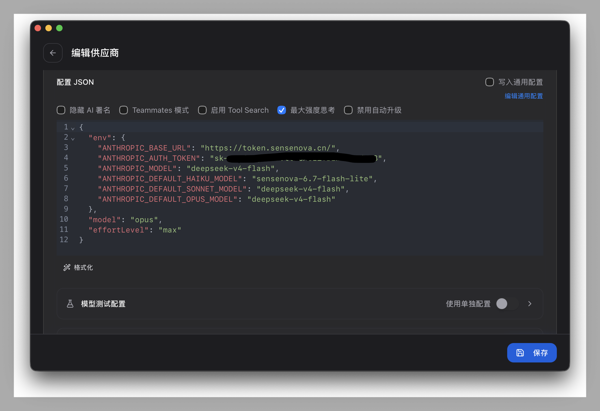

# SenseNova AI CLI 配置指南

> 商汤日日新 (SenseNova) 平台接入 Claude Code、Codex、Hermes Agent、OpenCode、OpenClaw 等 AI CLI 工具的完整配置指南。

## 目录

- [API 基础信息](#api-基础信息)
- [Claude Code 配置](#claude-code-配置)
- [Codex 配置](#codex-配置)
- [Hermes Agent 配置](#hermes-agent-配置)
- [OpenCode 配置](#opencode-配置)
- [OpenClaw 配置](#openclaw-配置)
- [cc-switch 配置（推荐）](#cc-switch-配置推荐)
- [故障排查](#故障排查)
- [常见问题](#常见问题)

## API 基础信息

| 项目 | 值 |
|------|-----|
| Base URL | `https://token.sensenova.cn/v1` |
| Anthropic Messages URL | `https://token.sensenova.cn/v1/messages` |
| OpenAI Chat URL | `https://token.sensenova.cn/v1/chat/completions` |
| 模型列表 | `https://token.sensenova.cn/v1/models` |
| 认证方式 | Bearer Token (`Authorization: Bearer sk-...`) |

### 可用模型

| 模型 ID | 说明 |
|---------|------|
| `deepseek-v4-flash` | DeepSeek V4 Flash（推荐用于 Claude Code） |
| `sensenova-6.7-flash-lite` | SenseNova 6.7 Flash Lite |

## Claude Code 配置

### ⚠️ 关键陷阱

Claude Code **内部会自动追加 `/v1/messages`** 到 `ANTHROPIC_BASE_URL`。因此 base URL **不能**包含 `/v1` 后缀。

```json
// ❌ 错误：会导致请求 https://token.sensenova.cn/v1/v1/messages → 404
"ANTHROPIC_BASE_URL": "https://token.sensenova.cn/v1"

// ✅ 正确：Claude Code 会自动补全为 https://token.sensenova.cn/v1/messages
"ANTHROPIC_BASE_URL": "https://token.sensenova.cn"
```

### 配置文件

编辑 `~/.claude/settings.json`：

```json
{
  "providers": [
    {
      "name": "sensenova",
      "apiKey": "sk-你的API密钥",
      "baseUrl": "https://token.sensenova.cn"
    }
  ],
  "model": "deepseek-v4-flash"
}
```

或者使用环境变量方式：

```json
{
  "env": {
    "ANTHROPIC_BASE_URL": "https://token.sensenova.cn",
    "ANTHROPIC_AUTH_TOKEN": "sk-你的API密钥",
    "ANTHROPIC_MODEL": "deepseek-v4-flash",
    "ANTHROPIC_DEFAULT_HAIKU_MODEL": "sensenova-6.7-flash-lite",
    "ANTHROPIC_DEFAULT_SONNET_MODEL": "deepseek-v4-flash",
    "ANTHROPIC_DEFAULT_OPUS_MODEL": "deepseek-v4-flash"
  }
}
```

### 验证

```bash
claude -p "Say hi"
```

## Codex 配置

Codex 使用 OpenAI-compatible API，base URL 需要包含 `/v1`。

编辑 `~/.codex/settings.json`：

```json
{
  "base_url": "https://token.sensenova.cn/v1",
  "api_key": "sk-你的API密钥",
  "model": "sensenova-6.7-flash-lite"
}
```

## Hermes Agent 配置

Hermes Agent 使用 `chat_completions` API 模式。

编辑 `~/.hermes/config.yaml` 或在 provider 配置中添加：

```yaml
providers:
  sensenova:
    base_url: "https://token.sensenova.cn/v1"
    api_key: "sk-你的API密钥"
    api_mode: "chat_completions"
    models:
      - id: "sensenova-6.7-flash-lite"
        name: "SenseNova 6.7 Flash Lite"
```

## OpenCode 配置

OpenCode 使用 `@ai-sdk/openai-compatible` 适配器。

```json
{
  "npm": "@ai-sdk/openai-compatible",
  "options": {
    "baseURL": "https://token.sensenova.cn/v1",
    "apiKey": "sk-你的API密钥",
    "setCacheKey": true
  },
  "models": {
    "sensenova-6.7-flash-lite": { "name": "SenseNova 6.7 Flash Lite" }
  }
}
```

## OpenClaw 配置

OpenClaw 使用 `openai-completions` API 模式。

```json
{
  "baseUrl": "https://token.sensenova.cn/v1",
  "apiKey": "sk-你的API密钥",
  "api": "openai-completions",
  "models": [
    {
      "id": "sensenova-6.7-flash-lite",
      "name": "SenseNova 6.7 Flash Lite"
    }
  ]
}
```

## cc-switch 配置（推荐）

[cc-switch](https://github.com/farion1231/cc-switch) 是一个跨平台桌面应用，可一站式管理所有 AI CLI 工具的 provider 配置。

### 使用内置 Preset（PR #2559）

cc-switch 已内置 SenseNova provider preset（由 [@DreamEnding](https://github.com/DreamEnding) 贡献），支持所有工具的一键配置。



> **注意**：Claude Code 的 `ANTHROPIC_BASE_URL` 在 preset 中已修正为 `https://token.sensenova.cn`（无 `/v1`），详见 [PR #2723](https://github.com/farion1231/cc-switch/pull/2723)。

### 手动添加

1. 打开 cc-switch → 供应商管理
2. 点击"添加供应商"
3. 选择或手动配置 SenseNova
4. 填入 API Key
5. 保存并同步到各工具

## 故障排查

### 调试流程

```bash
# 1. 查看 Claude Code 调试日志（最优先）
cat ~/.claude/debug/latest

# 2. 查找 [API REQUEST] 行确认实际请求 URL
grep "API REQUEST" ~/.claude/debug/latest

# 3. 直接测试 API
curl -s -w "\nHTTP_CODE:%{http_code}" https://token.sensenova.cn/v1/messages \
  -H "Authorization: Bearer sk-你的密钥" \
  -H "Content-Type: application/json" \
  -H "anthropic-version: 2023-06-01" \
  -d '{"model":"deepseek-v4-flash","max_tokens":10,"messages":[{"role":"user","content":"Hi"}]}'

# 4. 检查配置文件
cat ~/.claude/settings.json
```

### 常见错误

| 症状 | 原因 | 解决 |
|------|------|------|
| `[API REQUEST] /v1/v1/messages` | `ANTHROPIC_BASE_URL` 包含 `/v1` | 去掉 `/v1` 后缀 |
| 404 on `/v1/messages` | 该 provider 不支持 Anthropic Messages 格式 | 改用 OpenAI Chat 格式 |
| "Model not found" | 模型名称不匹配 | 检查 `/v1/models` 确认可用模型 |
| 401 Unauthorized | API Key 过期或错误 | 在商汤控制台重新生成 |
| settings.json 被还原 | cc-switch 文件监听器覆盖外部修改 | 从 cc-switch UI 内修改 |

## 常见问题

### Q: 为什么 Claude Code 的 base URL 不能带 `/v1`？

因为 Claude Code SDK 内部会自动在 `ANTHROPIC_BASE_URL` 后追加 `/v1/messages`。如果 base URL 已经是 `.../v1`，最终请求路径会变成 `.../v1/v1/messages`，导致 404。

### Q: 其他工具为什么可以用 `/v1`？

Codex、Hermes、OpenCode、OpenClaw 使用 OpenAI-compatible API，它们直接调用 `/v1/chat/completions`，不会自动追加路径段。所以 base URL 需要包含 `/v1`。

### Q: 如何查看 SenseNova 的可用模型列表？

```bash
curl -s https://token.sensenova.cn/v1/models \
  -H "Authorization: Bearer sk-你的密钥"
```

### Q: 如何查看 API 余量？

SenseNova 的余量查询需要 OAuth2 token（从浏览器 LevelDB 提取），API Key 本身不可查余量。

---

## 致谢

- [@DreamEnding](https://github.com/DreamEnding) — 提交 PR #2559 为 cc-switch 添加 SenseNova 内置支持
- [@farion1231](https://github.com/farion1231) — 维护 cc-switch 开源项目
- [SenseNova / 商汤日日新](https://platform.sensenova.cn) — AI API 服务

## 许可证

MIT